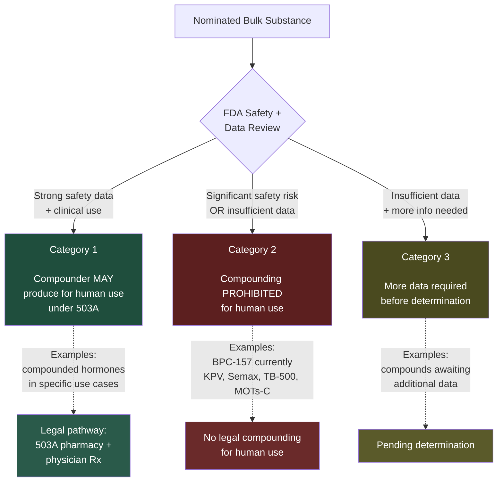
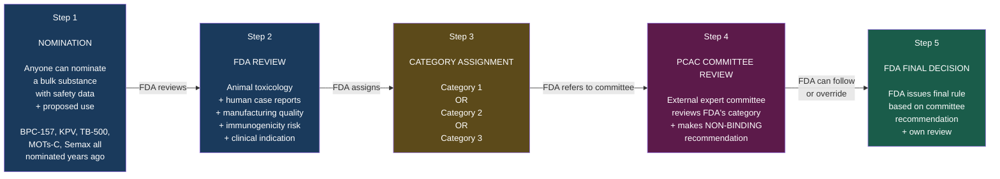
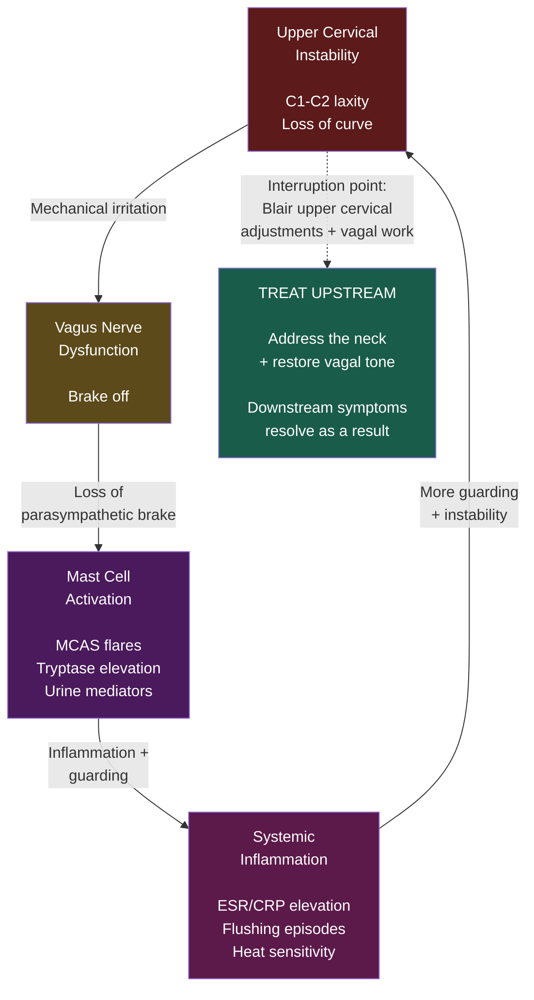
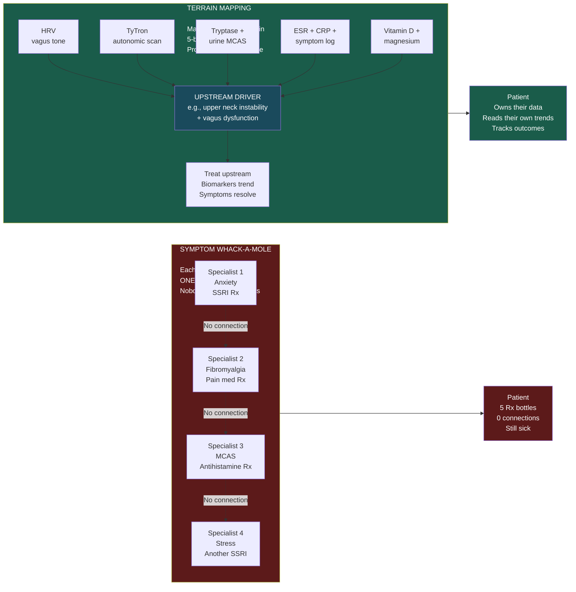
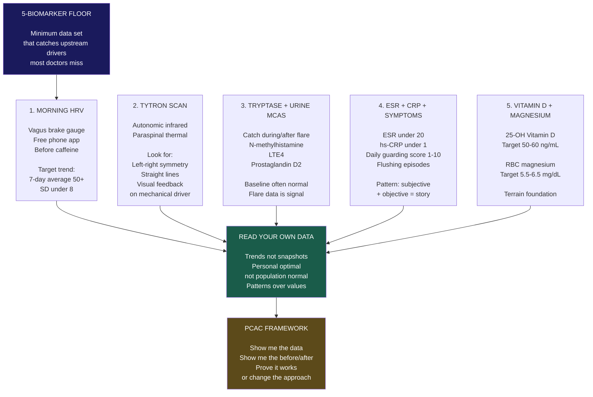

# PCAC Supporting Visuals — 5 Mermaid Diagrams

> Each diagram is a Mermaid block. Copy-paste into mermaid.live (https://mermaid.live) to render as PNG/SVG. The PNG/SVG versions are the ones used in Substack, Skool, LinkedIn, and sales surfaces.

---

## Diagram 1 — FDA Compounding Categories (Category 1 vs 2 vs 3)

**Use cases:**
- Substack post on PCAC meeting (Part 1 — pre-launch)
- LinkedIn carousel slide explaining FDA mechanics
- Skool onboarding Day 4 (vagus-neck mechanics + regulatory context)
- Sales page module explaining why PCAC framework operates upstream

**How to render:**
1. Copy the Mermaid block below
2. Paste into https://mermaid.live
3. Export as PNG (or SVG for higher quality)
4. Use filename: `pcac-category-mechanics.png`

---

## Diagram 2 — PCAC Timeline (FDA Process: Nomination → Committee → FDA Decision)

**Use cases:**
- Substack post on FDA PCAC meeting structure
- LinkedIn carousel explaining the 4-step process
- Hair-trigger activation reference (when does each step happen)
- Audio origin story chapter visual (optional B-roll)

**How to render:**
- Copy Mermaid → mermaid.live → PNG
- Filename: `pcac-timeline.png`

---

## Diagram 3 — Vagus-Neck-MCAS Vicious Loop (the upstream driver model)

**Use cases:**
- LinkedIn Carousel 1 (5 Biomarkers visualization)
- Substack Post — Terrain Mapping (already FINAL)
- Skool onboarding Day 4 (vagus-neck mechanics)
- Sales page Module 1
- Audio origin story The Data section (visual reference)

**How to render:**
- Copy Mermaid → mermaid.live → PNG
- Filename: `vagus-neck-mcas-loop.png`

---

## Diagram 4 — Symptom Whack-a-Mole vs Terrain Mapping (framework comparison)

**Use cases:**
- Substack Post 3 (PCAC framework long-form, Jul 8)
- LinkedIn Carousel 2 (PCAC framework visualization)
- Sales page Module 1
- Skool onboarding Day 1 (Welcome post framing)
- Audio origin story The Framework section (visual reference)

**How to render:**
- Copy Mermaid → mermaid.live → PNG
- Filename: `framework-comparison.png`

---

## Diagram 5 — The 5-Biomarker Floor (HRV / TyTron / Tryptase / ESR-CRP / Vitamin D-Mg)

**Use cases:**
- Substack Post 2 (How to read your own bloodwork)
- LinkedIn Carousel 1 (5 Biomarkers)
- Skool onboarding Day 2 (5 biomarkers intro)
- Lead magnet PDF (visual companion)
- Sales page Module 2 (terrain mapping)
- Audio origin story The Numbers section

**How to render:**
- Copy Mermaid → mermaid.live → PNG
- Filename: `5-biomarker-floor.png`

---

## How to render all 5 in one pass

1. Open https://mermaid.live in your browser
2. Create a new diagram for each block above (5 separate pastes)
3. Export each as PNG (1000-2000px width for sharp LinkedIn/Substack use)
4. Save to: `assets/visual/diagrams/` (create folder if needed)
5. Filenames per the per-diagram "How to render" sections

**Time estimate:** 5 minutes per diagram = 25 minutes total. All 5 ship-ready within an hour.

## How to use these in production

**Substack posts:**
- Post 2 (Jul 1, How to read bloodwork): Use Diagram 5 (5-biomarker floor) — referenced in the "5-marker floor revisited" section
- Post 3 (Jul 8, PCAC framework): Use Diagram 4 (framework comparison) + Diagram 3 (vagus-neck loop)
- Series Part 1 (Jul 15-21): Use Diagram 1 (category mechanics) + Diagram 2 (timeline)
- Series Part 2 (Jul 23-24, live): Use Diagram 1 + Diagram 2 as the visual frame

**LinkedIn carousels:**
- Carousel 1 (5 Biomarkers): Use Diagram 5 as one of the slides
- Carousel 2 (PCAC Framework): Use Diagram 4 as one of the slides
- New Carousel 6 (FDA mechanics): Use Diagram 1 + Diagram 2

**Skool onboarding:**
- Day 2 (5 biomarkers): Use Diagram 5
- Day 4 (vagus-neck mechanics): Use Diagram 3
- Day 5 (Bring Your Data): Use Diagram 5 (lighter version)

**Sales page (when built):**
- Module 1: Diagram 4 (framework comparison)
- Module 2: Diagram 3 (vagus-neck loop) + Diagram 5 (5-biomarker floor)
- Module 5 (Recon math): add Diagram 6 later (recon formulas)
- Module 7 (PCAC framework): Diagram 1 + Diagram 2

---

## Why Mermaid, not commissioned illustration

- **Speed:** ship in 25 min vs 2-4 weeks
- **Cost:** $0 vs $500-3,000 per illustration
- **Editability:** text-based, Mavis can iterate instantly
- **Compliance:** no third-party art dependencies
- **Reuse:** copy-paste across all surfaces
- **Versioning:** change a node, re-render

**Trade-off:** less polished than commissioned work. Commissioning Tier 4 visual assets (per `assets/visual/b-roll-audio-repurposing.md` Part 1) is a Q3 2026 priority when budget allows.

---

*Last updated: 2026-06-24 (Live Execution pass)*
*Ship-ready: yes. Awaiting Dre to render PNG/SVG via mermaid.live (~25 min total).*