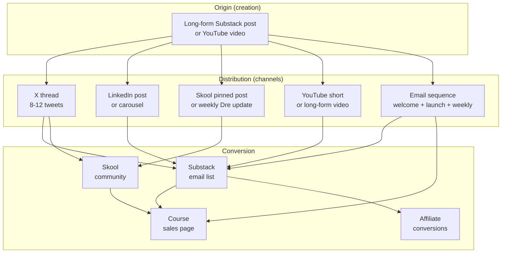

# Cross-Channel Map — Dose of Proof Content Flow

> How content moves between platforms. Each piece of long-form content creates 2-4 derivative pieces. The goal: 1 hour of creation → 4 hours of distribution.

## The flow (visual)



## The 4 channels — roles

| Channel | Role | Primary KPI | Cadence | Voice notes |
|---------|------|-------------|---------|-------------|
| **X (Twitter)** | Awareness + thread-style authority | Reach (impressions) + email signups from profile | Daily threads Mon-Fri, weekend light | Builder voice, contrarian, specific numbers |
| **YouTube** | Trust + long-form authority | Watch time + Sub clicks | 1 long video + 1 short per week | Raw, direct-to-camera, less polish |
| **Substack** | Owned channel — the moat | Email subscribers + paid tier conversion | 1 post/week Tue, daily during launch week | Personal letter voice, deeper than X |
| **Skool/PCAC** | Community + retention | Active members + monthly live Q&A attendance | 1 pinned post/week + monthly 90-min live call | Moderated, peer-group voice |

**LinkedIn** sits as a secondary channel: 1 post per week (Mon-Wed-Fri), repurposed from X or Substack content. Not a primary audience for the brand's biohacking content but valuable for the professional/operator positioning.

## The content multiplication rule

Every long-form piece (Substack post or YouTube video) gets distributed as:

| Format | Platform | Use case |
|--------|----------|----------|
| 1 long-form source | Substack OR YouTube | The original |
| 1 X thread (8-12 tweets) | X | Authority + reach |
| 1 LinkedIn post or carousel | LinkedIn | Professional credibility |
| 1 Skool pinned post | Skool | Community discussion |
| 1 short vertical clip (30-90 sec) | YouTube Shorts / IG Reels / TikTok | Top-of-funnel reach |
| 1 email excerpt | Substack welcome OR launch sequence | List engagement |

**One hour of creation → 4 hours of distribution.**

## The content categories per channel

### X (primary: awareness + threads)
- Thread type A: Origin story pulls (1-2 per week)
- Thread type B: PCAC framework education (1 per week)
- Thread type C: Lead magnet promotion (Weeks 1-2, then evergreen)
- Thread type D: Industry/commentary on FDA PCAC, supplements, etc. (as relevant)
- Standalone tweets: pull-quotes from origin story, biomarker numbers, real-time tracking

### YouTube (primary: trust + long-form)
- Long-form videos: 8-15 min, direct-to-camera, raw (Origin Story, biomarker explainers, PCAC framework deep dives)
- Shorts: 30-90 sec vertical clips from long-form (cut the most provocative moment)
- LIVE: FDA PCAC coverage on launch day (July 23 morning, Day 2 on July 24)

### Substack (primary: owned channel + moat)
- Weekly post (Tue): the long-form source for the week's content
- Daily during launch week (July 23-31): launch updates + FDA PCAC commentary
- Welcome sequence (7 emails): delivers the lead magnet + introduces the brand
- Launch sequence (12 emails): drives cart open → cart close

### Skool/PCAC (primary: community + retention)
- Weekly pinned post from Dre: "What's moving in my protocol this week"
- Monthly live 90-min Q&A: bring your data, get Dre's eye on it
- Member-contributed protocol library: moderated per the 5 unbreakable rules
- Founding-member badge for first 200 (year 1 only)

## How the channels feed each other (the loop)

```
Substack post (long-form)
    ↓
X thread (compressed version)
    ↓
LinkedIn post (professional angle)
    ↓
Skool pinned post (community discussion)
    ↓
YouTube short (top-of-funnel reach)
    ↓
(back to Substack — new subscribers from YouTube/LinkedIn traffic)
```

The Substack is the **hub**. Everything originates there or terminates there. The other channels are spokes that drive email subscribers + community members.

## Channel-specific KPIs (30-day targets)

| Channel | KPI | 30-day target |
|---------|-----|---------------|
| X | Impressions | 500K |
| X | Email signups from bio | 1,500 |
| YouTube | Watch hours | 200 |
| YouTube | Sub clicks to Substack | 1,000 |
| Substack | Free subscribers | 5,000 |
| Substack | Paid subscribers | 100 (at $84/yr = $8,400 ARR) |
| Skool free tier | Members | 500 |
| Skool paid (founding) | Members | 50 (within 200 cap) |
| LinkedIn | Follower growth | +2,000 |

## The "two PCACs" content engine

The brand's PCAC framework + the FDA's PCAC meeting create a unique dual engine:

| Phase | Brand PCAC content | FDA PCAC content |
|-------|---------------------|------------------|
| Pre-July 23 | Dominates — Substack posts + X threads explaining the framework | Referenced as "regulatory context" |
| July 23-24 | Live commentary translating FDA decisions through the brand PCAC lens | Peak — live coverage, real-time updates |
| Post-July 23 | Dominates — PCAC framework becomes the always-on content engine | Historical context — referenced in evergreen content |

Both PCACs are leveraged. The brand PCAC is the long-term moat. The FDA PCAC is the launch catalyst.

## Anti-patterns (channels)

- **No daily X posting on weekends** (engagement tanks, looks desperate)
- **No LinkedIn carousel without a real PDF deliverable** (LinkedIn penalizes "engagement bait")
- **No Substack post without a clear takeaway** (the email list is too valuable to waste)
- **No Skool pinned post without Dre's voice** (the community is operator-led, not algorithm-led)
- **No YouTube video without a CTA to Substack** (YouTube is a top-of-funnel channel, not a destination)

## Operational rhythm

- **Weekly content sprint:** Sun afternoon (or Mon morning) — create the week's long-form + plan the derivatives
- **Daily distribution:** 30-60 min in the morning for X + engagement, 30 min in the evening for Skool + community
- **Weekly review:** Fri afternoon — what worked, what didn't, adjust next week's plan
- **Monthly retrospective:** Last Fri of month — full KPI review, update calendar for next month