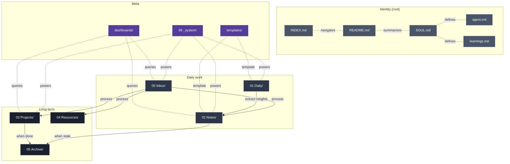

# INDEX — Mavis Vault

> Andre's second brain. Mavis (M3) is the steward.

## 📍 You are here

This is the entry point. Opens on Obsidian launch (Homepage plugin → `INDEX.md`).

## 🗺️ Quick navigation

| Where | What lives there |
|-------|------------------|
| [[README]] | Vault overview |
| [[SOUL]] | Who Mavis is, hard constraints |
| [[agent]] | Operating procedures, M3 cheat sheet |
| [[learnings]] | Discoveries, M3 capabilities, role history |

## 📂 Folder map

- **[[00 Inbox/]]** — raw captures, processed daily
- **[[01 Daily/]]** — one note per day (`yyyy-mm-dd.md`)
- **[[02 Notes/]]** — permanent notes, one concept each
- **[[03 Projects/]]** — active project subfolders
- **[[04 Resources/]]** — reference material by topic
- **[[05 Archive/]]** — completed / obsolete
- **[[99 _system/]]** — templates, dashboards, meta

## 🏗️ Architecture



## 🔥 Right now (today's captures)

```dataview
LIST
FROM ""
WHERE file.cday = date(today)
SORT file.ctime DESC
```

## 📋 Active projects

```dataview
LIST
FROM "03 Projects"
WHERE status = "active"
SORT priority DESC, started DESC
```

## 📥 Inbox

```dataview
LIST
FROM "00 Inbox"
SORT file.ctime DESC
LIMIT 20
```

## 📅 Recent daily notes

```dataview
LIST
FROM "01 Daily"
SORT file.name DESC
LIMIT 7
```

## 🌱 Recent permanent notes

```dataview
LIST
FROM "02 Notes"
SORT file.ctime DESC
LIMIT 10
```

## 🕸️ Hub notes (most-linked)

```dataview
LIST
FROM "02 Notes"
SORT length(file.inlinks) DESC
LIMIT 10
```

## 🌐 Orphan notes (need linking)

```dataview
LIST
FROM "02 Notes"
WHERE length(file.outlinks) = 0
```

## ⏸️ Stale notes (not touched in 90+ days)

```dataview
LIST
FROM "02 Notes"
WHERE file.mtime < date(today) - dur(90 days)
SORT file.mtime ASC
LIMIT 10
```

## ⏰ Overdue tasks

```dataview
TASK
FROM ""
WHERE !completed AND due < date(today)
SORT due ASC
```

## 🎯 Tasks due today

```dataview
TASK
FROM ""
WHERE !completed AND due = date(today)
SORT priority DESC
```

## 🏷️ Most-used tags

```dataview
LIST
FROM ""
GROUP BY tags
SORT length(rows) DESC
LIMIT 15
```

---

## 📊 Dashboards

Located in [[99 _system/dashboards/]]:

- [[Morning Brief]] — what to read first thing
- [[Weekly Review]] — Sunday 15-min cleanup
- [[Reading Queue]] — books/articles/papers
- [[Decision Log]] — one-way vs two-way door

## 🛠️ Templates

Located in [[99 _system/templates/]]:

- `daily.md`, `meeting.md`, `note.md`, `project.md`, `capture.md`, `resource.md`
- `weekly-review.md`, `monthly-review.md`, `book-digest.md`, `article-digest.md`
- `decision-log.md`, `1-on-1.md`, `retro.md`, `trip-plan.md`, `idea-park.md`, `contact.md`

## 🔌 Plugins powering this vault

Dataview · Templater · Calendar · Tasks · obsidian-git · Smart Connections · Local REST API · Homepage · QuickAdd

## 📦 Backup

Backed up to `git@github.com:andrebrassfield/MiniMax-Agent.git` via `obsidian-git` (auto-commit every 5min, auto-push).

---

*Last touched by Mavis: 2026-06-01*
